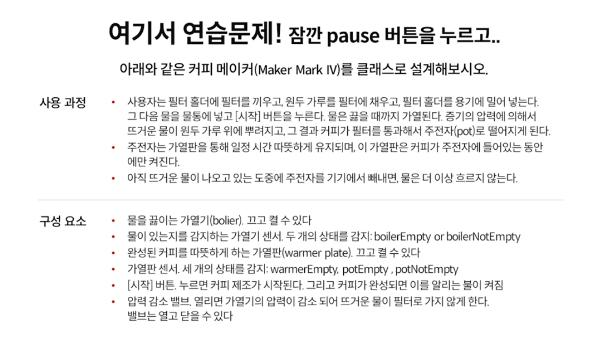
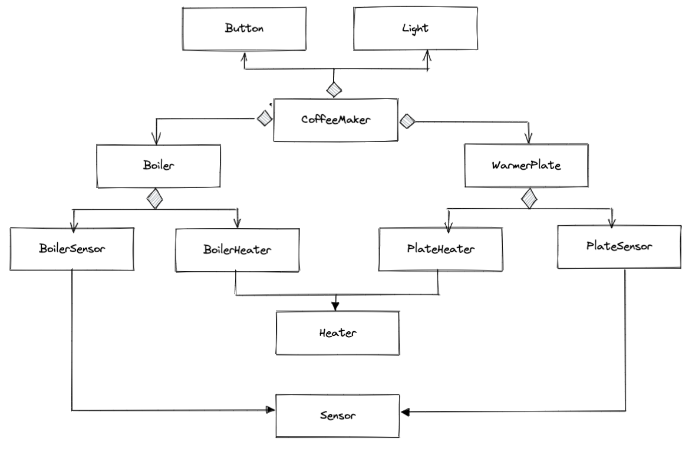

# 앱 아키텍쳐의 미드필더, 도메인 계층을 어떻게 설계할 것인가?

## Greenfield Project

들어가기 앞서, 만약 이커머스 앱을 새롭게 만들어야 할 때, 내가 개발팀의 총 책임자라면 2,3개월 간 무엇을 해야할까?

#### 기다린다

* “기획도, 디자인도 없는데 개발을 어떻게?”
* 추가 개발자들도 뽑아야 하고, 아직 초기라 이런저런 회의들도 많고 의외로 시간은 금방 지나간다.

#### 뭐라도 한다 (1) - 데이터 스키마 설계

* 필요한 엔티티(DB 테이블)들을 도출한다.
* 각 엔티티의 관계의 연결을 정의해본다.

#### 뭐라도 한다 (2) - 화면 중심 설계

* 확실히 필요할 것처럼 보이는 화면의 요소를 여기저기 만들어본다.
* 전체 화면 구성을 대충 도출해보고 각 화면으로 네비게이션 되는 간단한 뼈대를 만들어 본다.
* 디자이너에게 물어봐서, 이런 꼭 필요하지 않을까 싶은 애니메이션이나 복잡한 UI를 미리 구현해본다.
* 하지만 이는 디자이너와 생각하는 UI가 다르다면 전체적으로 변경될 가능성이 높다.

#### 기술적으로 준비한다 - 프로토타이핑

* 기술적으로 어려운 부분이 있을 것 같으면 그에 대한 유력한 해결책을 검토해조는 Proof of Concept을 만들어 본다.

### 데이터 중심의 설계란 없습니다

* **Behavior focus** vs **data centric focus**
  * 데이터 중심으로 설계한다면, DB를 만들 수는 있지만 테이블만 보고 앱을 설계할 수는 없다.
* 도메인 지식은 데이터베이스의 스키마로부터 뽑아낼 수 없다.
* 도메인 모델링은 도메인 전문가와 유저 스토리의 도움으로 이뤄져야 한다.

### 가장 중요하고, 잘 변하지 않는 것부터 시작하기

**기획자/비즈니스 부서와 함께 핵심 사용자 시나리오(Critical User Journey)부터 정한다.**

* 일단 구매 과정 중에서 우리 앱이 제일 중요한 것은 무엇인가?
* 상품을 기존과는 전혀 다른 형태로 보여주는 큐레이션 기능인가?
* 상품을 구매만 누르고 나머지는 아무 것도 필요 없이 그냥 바로 결제/배송까지 이어지는 기능인가?
* 상품을 선택하면 다른 앱들과는 비교하기 힘들게 좋은 구매 정보들을 보여주는 것일까?
* 이도 저도 아니고 사실 앱은 다른 서비스들과 똑같이 하고, 실제로 차별화는 백엔드에 있을까?

**그리고 핵심 사용자 시나리오를 코드로 옮긴다**

* 데이터, UI 등 가변 요소는 모두 배제하고 애플리케이션의 핵심을 먼저 구현 가능하다.
* 프로토타입과 달리 실 프로젝트에 그대로 사용이 가능하다.
* 다른 플랫폼에서도 재사용이 가능하다.
* 테스트도 함께 가능하다. 핵심 비즈니스 로직의 테스트가 만들어지기 때문이다(일종의 BDD)

### 핵심 사용자 시나리오

예를 들어보자. 회원 전용 기능이 필요한 건 확실하니 시나리오를 구성해보자.

**가변 요소**

* 회원 정보를 어떻게 저장할 지, 회원 가입 과정이 몇 페이지에 걸쳐서 이뤄질 지는 가변
* **기술적 결정 시점**

**(비교적) 불변 요소**

* 회원에게 어떤 정보를 꼭 받아야 하는가? 회원과 비회원의 차이는 무엇인가?
* **비즈니스 결정 시점**

## 도메인 계층은 무엇인가?

**UI 계층에서 사용되기 위한, 캡슐화 된 비즈니스 로직들을 모아 놓은 곳**

* 사용자 입력에 따라 Remote Data & Local DB Data 중 어떤 것을 선택하여 저장해야 하는가?
* 서버로부터 데이터를 받으면 어떻게 UI로 파싱하여 보여줘야 하는가?
* 구매 버튼은 어떤 페이지든 공통적으로 사용되는 핵심 기능이기 때문에 재활용 시점에서 유스케이스로 선정한다(내 생각).

**도메인 계층의 비즈니스 로직은 UI 계층과는 틀림**

* UI 계층의 비즈니스 로직과 의존이 없는 이외의 로직을 넣어야 한다.

### 왜 나누어야 하는가?(책임 관점)

**UI 계층과 데이터 계층 사이에 있는 책임들을 분리해줌**

* Separation of Concerns

**도메인 분리로 비즈니스의 규칙/전략의 변경이 타 계층에 영향을 주지 않음**

* 정확히 말하면 도메인 계층의 비즈니스 로직이 변경되면 타 계층의 변경에 영향을 완전히 주지 않을 수는 없다. 하지만 최소화 되어야 한다.

**코드 중복을 합리적으로 줄여 줌**

* 특정 행위가 반복된다면(ex: CustomView의 구매, 삭제 버튼을 눌렀을 때…) 도메인 계층의 유스케이스에 작성하면 중복을 줄일 수 있음

**테스트 가능성 증진: 비즈니스 룰만을 격리해서 테스트 할 수 있음**

### 도메인 레이어에서 하는 일

**도메인 비즈니스 로직**

* UI 와도, 데이터 계층과도 독립적인 비즈니스 로직

**데이터의 변환**

* 데이터 계층을 통해 전달 받은 엔티티(REST API를 통해 받아온 Json 파일, 데이터 스키마 …)를, 앱의 도메인 관점에서 필요한 형태로 변환

**UI 레이어에서 중복 사용되는 공통 로직**

### 왜 도메인 계층을 잘 설계하는 것이 중요한가?

**UI 계층과 데이터 계층 사이의 미드필더가 없을 때 생기는 설계상의 문제 해결**

* UI, Presenter 계층이 데이터 계층에 심하게 결합되어 있을 경우

**전체적인 로직이 UI에 집중하게 되면?**

* 당연히 안드로이드 애플리케이션에서 사용자가 직접 보고, 상호작용하는 UI 계층이 가장 중요하지만, 별개로 여기에 모든 로직을 과부하하게 역할을 주어주면 좋지 않음.
* 화면 중심적 사고
  * 화면을 넘나드는 로직들(앱이 시작하면 딜레이 되는 로딩 작업이 있다면?)
  * 특정 화면 뿐만 아니라, 전체 앱에 대한 상태 처리 시에도 곤란
* 애자일 프로세스가 오히려 좋은 설계를 방해하게 됨
  * Java 프로젝트에서 흔히 발생함. 작업으로 정의된 backlog / feature가 그대로 객체가 되는 불상사가 발생함
  * OOP의 올바르지 않은 방향으로 추상화가 되는 경우가 발생함

**데이터 엔티티에만 집중하면?**

* 도메인 계층과 데이터 계층을 데이터 스키마 중심으로 설계하는 것은 매우 전형적인 설계 오류
  * Remote 또는 Local에서 받아온 데이터 스키마가 그대로 UI 까지 전달되는 경우

### 커피 메이커(Maker Mark IV) 연습 문제

<figure><figcaption></figcaption></figure>

#### 첫번 째 답안

<figure><figcaption></figcaption></figure>

* 일반적으로 OOP 중심으로 설계 했다면 꽤 잘 만들어진 것처럼 보일 수 있다.
* 하지만 **행위가 잘 안 들어난다는 것**을 확인할 수 있다.
  * Button 클래스만 보면 유저가 버튼을 눌렀을 때 어떤 행위가 발생하는지 알 수 없다.
*   실제 코드로 옮겨 작성할 때도 실제 동작이 있어야 되는데, 중요해 보이는 사물들 중심으로 설계하여 어려워진다.

    * Light 클래스를 실제로 동작시키는 주체는 CoffeeMaker이다. 즉, Light 클래스는 CoffeeMaker에 단순히 명령을 중개해주는 껍데기에 불과하다.
    * 또한, Heater, Sensor 인터페이스도 공통적인 로직이라고 해봤자, turn on , turn off 밖에 없다.
    * 즉, 개념상으로만 좋아보일 뿐, 실속이 없다.

    <figure><figcaption></figcaption></figure>

**의도(행위), 즉 시스템의 어떤 행위나 어떤 일이 일어나는가에 집중하자. 사용과정을 파악해보자(구성요소로부터 X)**

<figure><figcaption></figcaption></figure>

<figure><figcaption></figcaption></figure>

* 의미 있는 인터페이스가 만들어짐
  * User Interface 같은 경우, “커피를 만들기 시작한다”라고 하는 함수만 있다. 이를 구현할 경우 위의 다이어그램은 버튼의 기능을 구현하는 M4 UserInterface가 있지만, 나아가 스위치 기능도 구현할 수 있다. 이를 상속받아 다르게 구현 가능
  * 각각의 행위의 특성을 가지는 부모를 인터페이스를 통해 상속받을 수 있어 구현이 가능
  * 인터페이스 별로 나뉘어져 있으며 어떤 것을 구현 하는지 명확히 알 수 있음

### DDD(Domain-Driven Design)란 무엇인가?

**프로세스에 대한 깊은 지식을 담고 있는 도메인 모델과 도메인 모델과 도메인 규칙들의 개발을 중심에 놓은 개발 방법**

* 제대로된 객체 모델링을 위해서 핵심 행위, 액터들을 먼저 추상화된 형태로 만드는 것이 훨씬 중요하다.

도메인에 대한 정의를 내리는 것이 왜 어려운 작업일까?

* 도메인을 어디서부터 모델링 해야 할까?
* 정답이 없음
* 행위와 도메인 지식을 바탕으로 끊임없이 고민해야 함

### 왜 모바일 개발자도 도메인 주도 설계(DDD)를 알아야 하는가?

* 모바일 개발자 입장에서 이제까지 큰 설계에 있어서 UI 계층과 데이터 계층을 어떻게 연결할 것인가에 대해 접할 정보가 거의 없었음
* 화면 중심 사고로 도메인 / 데이터 계층을 다루는 것은 좋지 않은 생각
* **DDD는 불변(혹은 다른 계층의 요소들에 비해 잘 바뀌지 않는)하는 도메인을 어떻게 올바르고 효과적으로 설계하는 지를 알려줌**

### 도메인 계층을 구성하는 유형

<figure><figcaption></figcaption></figure>

DDD Lite의 경우 백엔드에서는 지양하는 방법론이지만, 모바일 환경에서는 사용될 수 있다. 또한 DDD Lite에서 말하는 Use Case란, 하나의 객체 안에서 하나의 메서드만 가지고 있어, 그 명령 자체를 캡슐화하고 있는 것을 의미한다.

### RFC

**The RED : 강사룡의 앱 안정성 및 확장성 강화를 위한 Android 아키텍처**

