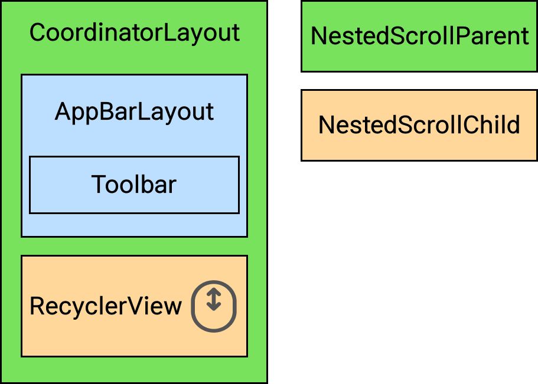

# introduce & issue

### CoordinatorLayout

`CoordinatorLayout` 은 매우 강력한 기능을 가진 `FrameLayout` 이다.

1. 애플리케이션에서 최상위 장식(decor) 뷰로써 사용
2. 자식 뷰들 간의 특정한 인터렉션을 지원하는 컨테이너로써 사용

`CoordinatorLayout` 의 자식 뷰에 `Behaviors` 를 지정하는 방식으로, 하나의 부모 뷰 안에서 다양한 상호작용을 지원할 수 있다. 또한 자식 뷰들 간의 인터렉션을 수행할 수 있다.

`Behaviors` 는 슬라이딩 드로어나 스와이프 해제 액션 등 뷰의 다양한 움직이나 애니메이션에 따른 상호작용을 구현하기 위해서 사용된다.

`CoordinatorLayout` 의 자식 뷰는 `anchor` 를 가지게 될 것이다. `anchor` 는 일반적으로 다른 뷰들을 지칭하며, 뷰의 id 값으로 표시된다. `anchor` 는 반드시 `CoordinatorLayout` 하위의 자식 뷰 중 하나이어야 하며, 다른 뷰에 맞물러 상대적인 위치에 뷰를 띄우는 용도로 사용된다.

`insetEdge` 속성은 자식 뷰들이 어떻게 배치될지 지정할 수 있으며, 만약 자식 뷰가 겹칠 것을 대비해서 `dodgeInsetEdges` 속성을 주어 적절하게 뷰가 겹치지 않도록 배치할 수 있다.

### Behavior

자식 뷰들 간의 하나 혹은 그 이상의 인터렉션(스와이프, 드래그 ...) 또는 뷰 배치들을 구현하기 위해서 사용된다.

자식 뷰에 `Behavior` 가 지정되어 있다면, `CoordinatorView` 는 그것을 토대로 (부모 뷰 - 자식 뷰 ) / (자식 뷰 - 자식 뷰)의 소통(?)을 구현한다.

`CoordinatorView` 에서 자식 뷰와 소통해야 하는 부분(인터렉션, 뷰 배치 등)에서 `Behaivor` 를 사용하는 코드를 확인할 수 있다.

### Anchor

Anchor는 자식 뷰들 간의 연관성을 표현하는 개념이다. CoordinatorLayout 안에서 어떤 자식 뷰의 배치나 인터렉션이 있을 때, 연관된(Anchor로 등록된) 자식 뷰들에게 상태 변화를 알려주도록 구현하기 위해서 사용된다. 연관성을 표현하기 위해서 내부적으로 그래프를 이용한다.

### LayoutParams

CoordinatorLayout은 다른 몇몇 레이아웃처럼, 자신에게 특화된 LayoutParams 정적 클래스를 가지고 있다. LayoutParams 클래스는 Behavior와 anchor 정보를 가지고 있어, 부모가 요청할 때마다 그 정보를 넘겨주도록 구현되어 있다.

### Issue

중첩된 `CoordinatorLayout`을 사용하는 경우에 `Child Coordinator`의 스크롤 동작이 `Parent Coordinator`로 전파되지 않는 이슈를 해결하기 위해서 정리한다.

`NestedScrollEvent` 위젯에서 발생한 scroll을 parent(NestedScrollingParent)로 전달하며, 각 위젯별로 `consumed`, `unconsumed`, `x`, `y` 값을 활용하여 `NestedScrolling`을 구현한다.

밑의 예에서, RecyclerView(NestedScrollingChild)에서 스크롤 이벤트가 발생하면 `CoordinatorLayout`으로 이벤트가 전파되며, `RecyclerView`에 포함된 child layout의 behavior(AppBarLayout, RecyclerView ...)에 해당 이벤트를 전달한다.

현재 진행중인 프로젝트에서는 아래와 같은 중첩된 `CoordinatorLayout` 구조를 가지고 있다. inner RecylcerView(NestedScrollingChild) 의 스크롤 이벤트가 발생하면 outer Coordinator에는 스크롤이 전파되지 않는 문제가 발생한다.

이러한 문제를 해결하기 위해 inner `RecyclerView` 에 필요한 Coordinator.behavior의 내부 메서드(onInterceptTouchEvent, onNestedScroll, onNestedFling ...)들을 오버라이드하여 구현해야 한다.&#x20;

.png>)

### RFC








