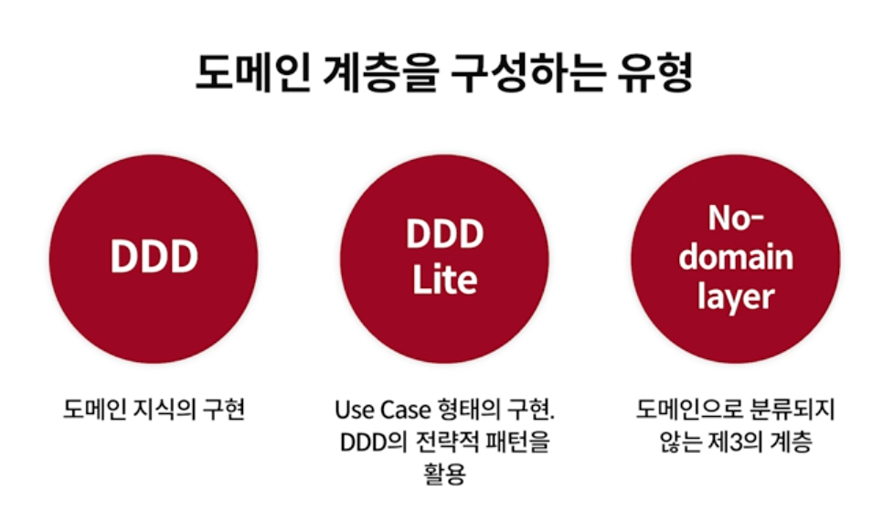

# Tutorial

### Thread 구조와 다중 Thread 작업의 필요성



위의 그림을 보면, JVM 프로세스는 메인 스레드가 종료되면 강제로 종료되며, JVM 프로세스에 속한 스레드도 함께 강제 종료된다. 메인 스레드 이외의 스레드들은 그 중 하나의 스레드가 종료된다고 해서 다른 스레드에 영향을 미치지 않는다.

메인 스레드에 많은 부하가 생기는 작업에 의해 블로킹된다면, 해당 프로세스는 종료될 것이다. 따라서 메인 스레드에서 많은 부하를 받는 작업을 지양해야 하며, 다른 스레드를 생성해 해당 스레드에 높은 부하를 주는 작업을 수행하도록 만들어야 한다.

### 기존의 접근 방식과 한계점

Runnable 인터페이스, ExecuterService, Rx 라이브러리 등 기존 접근 방식들의 한계점은 작업의 단위가 스레드란 점이다.

스레드는 생성 비용이 비싸고 작업을 전환(contextswitching)하는 비용이 비싸다. 또한, 하나의 스레드가 다른 스레드로부터의 작업을 기다려야 할 때 블로킹 된다면, 해당 스레드는 하는 작업 없이 다른 작업이 끝마칠 때까지 기다려야 하기 떄문에 자원이 낭비된다.

.png>)

### 코루틴은 기존 한계점을 어떻게 극복하는가?

.png>)

코루틴에서도 스레드라는 작업의 단위를 사용하지만, 스레드 내부에서 작은 스레드처럼 동작하는 코투린이 존재한다. **스레드 하나를 일시중단 가능한 경량의 스레드처럼 활용하는 것이 코루틴이다.**

코루틴(coroutine)은 루틴의 일종으로써, 협동 루틴이라고 할 수 있다(코루틴의 "co"는 with 또는 togather를 뜻한다). 루틴과 서브 루틴은 서로 비대칭적인 관계이지만, 코루틴들은 완전히 대칭적인, 즉 서로가 서로를 호출하는 관계이다.

코루틴을 사용할 때, 무엇이 무엇의 서브루틴 인지를 구분하는 것은 불가능하다. 코루틴 A와 B가 있다고 할 때, A를 프로그래밍 할 때는 B를 A의 서브루틴으로 생각한다. 그러나 B를 프로그래밍할 때는 A가 B의 서브루틴이라고 생각한다. 정리하자면, 어떠한 코루틴이 발동될 때 마다 해당 코루틴은 이전에 자신의 실행이 마지막으로 중단되었던 지점 다음의 장소에서 실행을 재개한다.

### 코루틴 특징

#### 협력형 멀티 태스킹

협력형 멀티태스킹을 프로그래밍 언어로 표현하자면 Co + Routine이다. Co라는 접두어는 "협력" , "함께"라는 의미를 지니고 있고, Routine은 하나의 작업, 함수라고 생각하면 된다. 두 개의 뜻을 종합하자면 협력하는 함수라고 표현할 수 있다.

Routine에는 main routine과 sub routine이 존재한다.

```kotlin
fun main() { 
	foo().forEach { value -> println(value) }  
}
**=> main routine**

fun foo() : List<Int> = listOf(1,2,3)
**=> sub routine**
```

위에 코드를 보면 main 함수가 Main 루틴이다. 즉, 메인이 되는 함수인 것이다. 메인이 되는 함수는 다른 서브 함수인 foo()를 호출한다. 우리가 흔히 작성하는 프로그램이 이렇게 구성되어 있어 이해하는데 어려움이 적다.

sub routine에는 한 가지 특징이 있다. 아래 그림을 참고한다.

sub routine은 루틴에 진입하는 지점과 루틴을 빠져나오는 지점이 명확하다. 즉, 메인 루틴이 서브 루틴을 호출하면, 서브 루틴의 맨 처음 부분에 진입해서 return 문을 만나거나 서브 루틴의 닫는 괄호를 만나면 해당 서브 루틴을 빠져나오게 된다.

.png>)

코드로 다시 이해해보자.

.png>)

메인 스레드가 fun()이라는 서브루틴에 진입한다. 서브 루틴에서 절차적으로 실행될 것이고, 마지막으로 값을 받아 출력해줌으로써 서브루틴을 호출 했던 부분으로 탈출한다. 그리고 진입점과 탈출점 사이에 스레드는 블락되어 있을 것이다. 이러한 루틴이 우리가 흔히 작성했던 코드의 절차이다.

그러나 코루틴(coroutine)은 다르다.

.png>)

코루틴 함수는 진입할 수 있는 진입점도 여러개고, 함수를 빠져나갈 수 있는 탈출점도 여러개다. 즉, 코루틴 함수는 꼭 return이나 마지막 실행문까지 실행하지 않더라고 언제든지 중간에 나갈 수 있고, 언제든지 다시 나갔던 그 지점으로 들어올 수 있다.

```kotlin
fun fooB() {
	startCoroutine {
		plus()
		minus()
		division()
	}
}

suspend fun plus() {
	delay(2000)
	...
}

suspend fun minus() {
	delay(5000)
	...
}

suspend fun division() {
	delay(3000)
	...
}
```

위 코드를 보면, fooB()라는 함수가 존재한다. 해당 함수 안에는 startCoroutine이라는 코루틴 빌더가 있다(실제로 startCoroutine이라는 빌더는 존재하지 않는다. 실제 코루틴 라이브러리에서는 다른 방식으로 코루틴을 만들지만 이해를 돕기 위해 가상의 빌더를 사용한다.)

startCoroutine이라는 코루틴을 만나게 되면 해당 함수는 코루틴을 작동할 준비가 된다. 따라서 suspend 키워드로 선언된 함수를 만나면 언제든 함수 실행 중간에 나갈 수도 있고, 다시 들어올 수도 있는 자격이 부여된다.

1. 스레드의 메인 함수가 fooB()를 호출하면 startCoroutine 블럭을 만나 하나의 코루틴을 만들어 동작한다. 위에서도 언급했듯이 fooB()는 진입점과 탈출점이 여러개가 되는 자격이 주어진 것이다.
2. 코루틴이 실행되더라도 suspend 함수를 만나기 전까지는 그다지 특별한 특징이 없이 진행된다. suspend 함수가 없다면 해당 함수의 마지막 실행지점까지 계속 실행된다. 하지만 plus, minus, division 함수는 suspend 함수로 정의되어 있으므로, fooB() 함수 실행 중 plus() 함수를 만나게 되면 fooB() 함수 코드를 더 이상 실행하지 않고 멈추고(suspend) 코루틴 block을 (잠시)탈출한다.
3. 메인 스레드가 해당 코루틴을 탈출했지만, 스레드는 그와 상관 없이 다른 코드들을 실행하고 있을 것이다. 예를 안드로이드로 가정하면 UI 애니메이션을 처리하고 있을 것이다. 즉, plus, minus, division suspend 함수는 어디선가 비동기적으로 실행되고 있을 것이다. 메인 스레드에서 동시성 프로그래밍으로 작동하고 있을 수 도 있고, 다른 스레드에서 실행되고 있을 수도 있다. 스레드를 결정하는 것은 개발자가 자유롭게 선택할 수 있다.
4. 메인 스레드가 다른 코드들을 실행하다가, plus() 함수가 종료되면 다시 아까 탈출 했던 코루틴 fooB()로 돌아온다. 이렇게 코루틴 빌더를 실행하게 된다.

#### 동시성(Concurrency) 프로그래밍

논리적인 용어로 동시에 실행되는 것처럼 보이는 것을 의미한다.

싱글 코어(멀티 코어도 가능)에서 멀티스레드를 동작시키기 위한 방식으로 멀티 태스킹을 위해 여러 개의 스레드가 번갈아 가면서 실행되는 방식이다.

동시성을 이용한 싱글 코어의 멀티 태스킹은 각 스레드들이 병렬적으로 실행되는 것처럼 보이지만, 서로 번갈아 가면서 실행되고 있는 방식이다.

동시성과 병렬성의 개념이 혼동될 수 있으므로 간단히 설명한다. 병렬성(Parallelism)은 멀티 코어에서 멀티 스레드를 동작시키는 방식으로 데이터 병렬성과 작업 병렬성으로 구분된다.

.png>)

동시성 프로그래밍과 병렬성 프로그래밍 모두 비동기 동작을 구현할 수 있지만, 동작 원리가 다르다.

* 동시성: 통장을 만들러 온 N개의 대기열과 한 명 이상의 은행 직원
* 병렬성: 통장을 만들러 온 N개의 대기열과 N명의 은행 직원

.png>)

코루틴은 개념 자체로만 본다면 병렬성을 지원하는 것이 아닌 동시성을 지원하는 개념이다.

.png>)

위 코드에서는 메인 스레드에 코루틴이 두 개가 있다는 것으로 가정해보자.

메인 함수에서 먼저 코루틴 A의 fooA()를 만나서 코루틴 블럭이 생성되어, suspend 함수들을 만나 코루틴을 잠시 빠져나가 실행될 것이다.

코루틴 A를 빠져나갔다고 메인 스레드가 놀고 있진 않을 것이다. 다른 suspend 함수를 찾거나 다른 코드들을 찾을 것이다. 코루틴 A의 경우 2초 동안 plus() 작업을 하게 된다. 그러나 delay(2000)은 스레드를 블락시키지 않으므로 다른 일들을 할 수 있다. 뿐만 아니라 plus() 함수 안에서 다른 스레드를 실행시킨다면 병행적으로도 실행이 가능하다.

코루틴 A를 빠져나온 스레드가 코루틴 B를 만나게 되어 suspend 함수를 만나 이전과 같이 실행 절차를 가질 것이다. 이렇게 A와 B를 아주 빠르게 동시에 실행하게 될 것이다. 이렇게 코루틴을 사용해서 스레드 하나에서 동시성 프로그래밍이 가능하다.

코루틴을 생성해서 동시성 프로그래밍을 하는 것은, 스레드를 사용해서 프로그래밍을 하는 것과 다른 차원의 효율성을 제공한다. 위에서 설명했던 동작을 스레드 2 개를 만들어 실행했다고 가정해본다.

.png>)

CPU는 단 한 개 뿐이기 때문에, Thread A,B의 실행을 빠르게 이동하면서 반복하기 위해서는 CPU가 매번 스레드 점유를 했다가 놓아주고, 새로운 스레드를 점유했다가 놓아주고를 반복해야 한다. 이를 Context Switching이라고 한다. 하나의 스레드에서 단순히 함수를 이동하는 것과는 다르게 비용이 꽤 드는 작업이다.

🗨️ 2,000개 미만의 스레드에는 1.5GB 이상의 메모리가 필요하다. 100만 개의 코루틴은 700MB 미만의 메모리가 필요하다. 결론은 코루틴은 매우, 매우 가볍다는 것이다.

#### 편리한 비동기 처리

위에서 설명한 코틀린의 능력으로 비동기 처리가 굉장히 편리해진다.

**callback**

```kotlin
fun goLab(person: Person) {
	val 세미나를듣기전에준형 = person
	
	kotlinSeminar(세미나를듣기전에준형) { koltinClass ->
		osSeminar(kotlinClass) { osClass ->
			dockerSeminar(osClass) -> { dockerClass 
					val 세미나를마친준형 = finish(dockerClass)
					세미나를마친준형.goHome()
			}
		}
	}
}
```

콜백으로 비동기 처리를 구현했을 때 흔히 겪는 콜벡지옥이다. 에러 처리도 하지 않은 코드인데 코드 가독성이 현저히 떨어진다. 비동기 처리를 위한 다양한 방법론이 나오기 전에는 대부분 이런 방식으로 처리했다.

**RxKotlin**

```kotlin
fun goLab(person: Person){
	val 세미나를듣기전에준형 = person

	Observable
				.just(person)
				.observeOn(MAIN_Thread)
				.subscribeOn(IO_Thread)
				.flatMap { 세미나를듣기전에준형 -> kotlinSeminar(세미나를듣기전에준형) }
				.flatMap { 운영체제세미나 -> osSeminar(운영체제세미나) }
				.flatMap { 도커세미나 -> dockerSeminar(도커세미나) }
				.subscribe({ 세미나를마친준형 ->
					세미나를마친준형.goHome()
				},{
					error()
				})
}
```

콜백 코드보다 가독성이 훨씬 좋아진 것을 느낄 수 있다. kotlinSeminar, osSeminar과 같은 함수들이 순차적으로 보이기 때문에 가독서이 좋아진 것을 볼 수 있다. 즉, 각 과정의 함수들이 동일한 depth를 유지하며 동기적인 코드처럼 보이기 때문이다.

하지만 Rx를 모르는 개발자가 보기엔 너무 어려운 코드일 수 있다. Rx가 제공하는 정말 편리한 operation들이 상당히 많기 때문에 학습 곡선이 높기로 유명하다. 하지만 Rx를 학습한 개발자는 높은 학습 곡선 만큼 효율성도 높다.

**Kotlin + coroutine**

```kotlin
suspend goLab(person: Person) {
	val 세미나를듣기전에준형 = person
	
	try {
		val 코틀린세미나 = kotlinSeminar(세미나를듣기전에준형)
		val 운영체제세미나 = osSeminar(코틀린세미나)
		val 도커세미나 = dockerSeminar(운영체제세미나)
		val 세미나를마친준형 = finsin(도커세미나)
		
		세미나를마친준형.goHome()
	} catch (e: Exception) {
		error()
	}
}
```

코틀린과 코루틴을 사용하면 코드 가독성, 비동기 처리에 정말 큰 편리함을 제공한다. 안에서 호출되는 각 함수들은 네트워크를 타고 실행되어야 하는 오래걸리는 작업이고, 언제 끝날지 모르는 비동기 작업들이지만, 각 함수들의 순서는 정확히 지켜진다.

이러한 비동기 처리가 가능한 이유는, goLab 함수는 코루틴이기 때문이다. kotlinSeminar 함수를 실행함과 동시에 잠시 goLab을 빠져나간다. kotlinSeminar 함수가 종료되면 다시 goLab으로 돌아와 실행될 것이다. 이게 코루틴으로 비동기 처리를 할 때 생기는 장점이다.

***

### RFC

[https://kotlinworld.tistory.com/139](https://kotlinworld.tistory.com/139)
